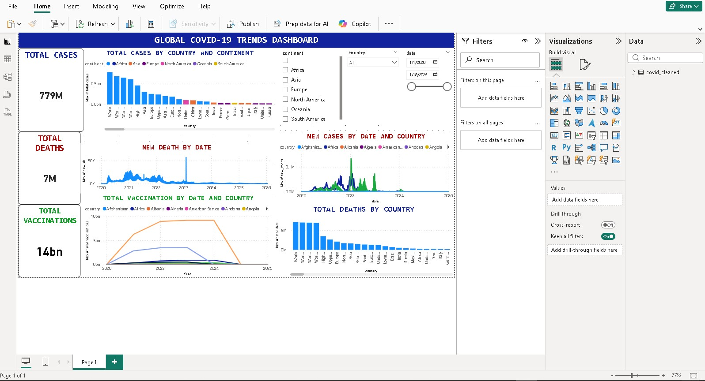

# Global COVID-19 Trends Dashboard

## Project Overview
This project analyzes real-world COVID-19 data to provide insights into the spread of the pandemic, death rates, and vaccination progress across countries and continents.  
An interactive dashboard was created in Power BI to visualize key metrics and trends, allowing dynamic exploration through slicers for country, continent, and date.

## Dataset
The dataset is sourced from publicly available COVID-19 records and contains:

- Country and continent information  
- Daily new and total COVID-19 cases  
- Daily new and total deaths  
- Vaccination counts and coverage  
- Population and demographic data  

The cleaned dataset used in this project is included in the `data/` folder as `compact.csv`.

## Tools Used
- **Python**: for data cleaning and preprocessing (`pandas`)  
- **Power BI Desktop**: for dashboard creation  
- **Images**: screenshots to showcase dashboard functionality

## Key Insights
- Total COVID-19 cases, deaths, and vaccinations are summarized in interactive KPI cards.  
- Trends over time are shown with line charts for new cases and new deaths.  
- Comparison across countries is visualized with bar charts for total cases and death rates.  
- Users can filter data dynamically using slicers for continent, country, and date.

## Dashboard Preview

## Live Dashboard / PBIX File
The full Power BI dashboard file is too large to upload to GitHub.  
You can download and explore it here:  

[Download COVID-19 Dashboard (Google Drive)](https://drive.google.com/file/d/1cSxHK8jfr352cP35JuX420uaQUiJSO7c/view?usp=sharing)

---

## Project Files
- `data/` → cleaned dataset (`compact.csv`)  
- `images/` → screenshots of the dashboard  
- `README.md` → this project description file

## How to Use
1. Download the Power BI dashboard file using the link above.  
2. Open the file in **Power BI Desktop**.  
3. Explore the dashboard using the interactive slicers for country, continent, and date.  
4. Observe KPI cards, line charts, and bar charts updating dynamically.

## Author
**Olanrewaju A. Daniel**  
Agricultural Economist | Data Analyst | Media Enthusiast  
[LinkedIn](https://www.linkedin.com/in/olanrewaju-daniel-774370253)
